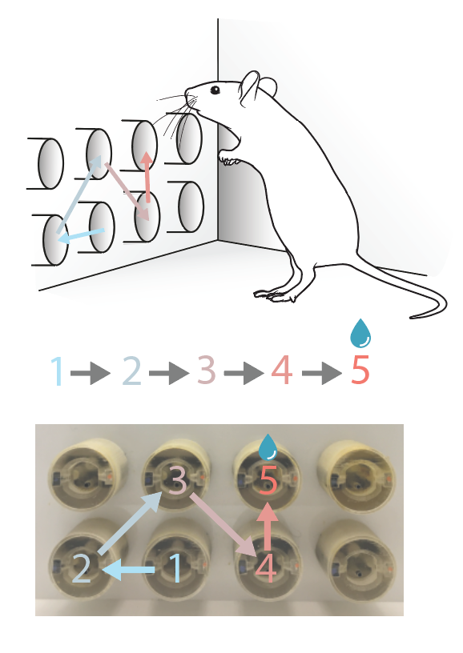

# sequences_behaviour
scripts for running and post-hoc analysis of the 8 poke sequence behavioural task (behavioural and video tracking data)

# Analysis of behavioural data for the Seqeuence task 

See our publication for more details: [Replay of Procedural Experience is Independent of the Hippocampus](https://www.biorxiv.org/content/10.1101/2024.06.05.597547v1.full.pdf).

## Overview

This repository includes:
- A version of the task in BPOD file format (matlab/Sequence_Automated)
- Tidied* python notebook scripts for processing BPOD output
- An example notebook script for analysis of tracking data

(*)These scripts are from the early years of my phd so are a little rough. I havent refactored them  but I have been though and tidied them - so they should be useful and readable but are not fully polished...

## Getting Started

Ensure you have the following software installed:
- [Git](https://git-scm.com/)
- [Python](https://www.python.org/downloads/)  (Version used: 3.12.3)
- Jupyter notebook
- Necessary Python libraries: this pipeline worked with the environment I have listed in requirements.txt (though some of these packages may be redundant)  

## Main data pipeline

**1_process_bpod_output**

 - Notebook script which takes the matlab output from running the behaviour and produces python readable processed data 

**2_analyse_individual_sessions**

- Takes output files from process_bpod_output and returns analysis plots for each behavioural session

**3_analyse_across_sessions**

- Same as step 2 but produces summary data across the sessions for each animal

## Extended analysis scripts

**AcrossAnimal_analysis**

- Takes the outputs from the first 3 steps and creates summary plots which compare the task abilities of multiple animals 

**Tracking_analysis_examples**

- Takes output from deeplabcut tracking: https://deeplabcut.github.io/DeepLabCut/README.html
- Tracking points are the head of the mouse and each of the task relevant (5) behavioural ports. 
- This script loads some example data, and goes step by step through processing and analysis to determine how stereotyped port to port movements were during the task. 
- See figure1 and supliments in our paper for some examples of applications of this analysis : [Replay of Procedural Experience is Independent of the Hippocampus](https://www.biorxiv.org/content/10.1101/2024.06.05.597547v1.full.pdf).
